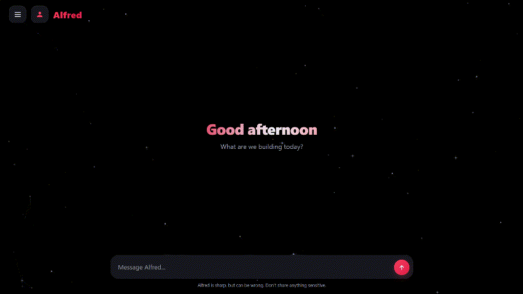

<div align="center">

# ⚡ Alfred

### Retrieval-augmented conversational AI, engineered from a multi-agent DAG-orchestrated system and shipped to the edge.

[](https://alfred.tusharentheoria.workers.dev)


**Designed and built by Tushar**

[](https://alfred.tusharentheoria.workers.dev)

</div>

---

I built Alfred end to end. It's a **retrieval-augmented conversational AI** that runs entirely at the **network edge**, with no origin server in the path. Every message hits a **Cloudflare Worker**, clears an in-worker **abuse guard** (per-IP token-bucket rate limiting, flood detection, automatic bans), gets grounded against a **Vectorize** vector index for **RAG**, threaded with conversation state from **Workers KV**, then **streamed back token by token over Server-Sent Events**. It's the public front end of the **multi-agent, DAG-orchestrated** system I architected.

## 🚀 Live Deployment

Running in production, serverless on **Cloudflare's global edge**: **[alfred.tusharentheoria.workers.dev](https://alfred.tusharentheoria.workers.dev)**. Requests execute and stream from whichever edge location is closest to the user, so there are no cold origins and no infrastructure to babysit.

## 🧰 Tech Stack


## ✨ Capabilities

- **Edge-native streaming.** Token-by-token responses over SSE, straight from the Worker.
- **Vector RAG.** I embed each query, pull the nearest facts from a **Vectorize** index, and ground the model on them so answers stay factual.
- **Stateful memory.** Conversation state persisted in **Workers KV**, keyed to a signed, HttpOnly session cookie.
- **Client-side chat history.** A saved-chats sidebar backed by localStorage; nothing conversational touches a server.
- **Custom Canvas UI.** A hand-tuned starfield renderer in raw Canvas 2D (twinkle, depth parallax, shooting stars), zero UI libraries.
- **In-worker abuse guard.** Token-bucket rate limiting, flood and duplicate detection, auto-ban, and graceful load-shedding under pressure.
- **Hardened by default.** Strict CSP, anti-clickjacking headers, SRI-pinned CDN assets, timing-safe admin-key checks, and role-whitelisted history validation.

## 🏗️ Architecture

```
Visitor  ->  Edge Worker
                |-- Guard     rate-limit, flood, auto-ban, input hygiene
                |-- Context   RAG retrieval (Vectorize) + memory (KV)
                |-- Persona   identity + safety rails
                |-- Model     ->  streamed reply
```

A directed-acyclic request pipeline (guard, context, persona, model). Each stage is isolated and independently testable, and the assistant itself is one node in the broader multi-agent system I built.

## 🛡️ Security

Red-team and stress tested. In simulation the guard absorbed floods of hundreds of thousands of requests per second with the abuser auto-banned, and the prompt surface is hardened against injection and jailbreak attempts.

## 📄 Notice

This repository showcases the architecture and interface of a personal project. The knowledge base, prompts, model configuration, and production secrets that power the live system are private and not included here.

Copyright (c) 2026 Tushar. All rights reserved. Not licensed for copying, redistribution, or derivative works.
